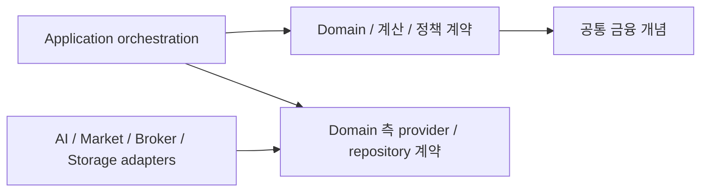
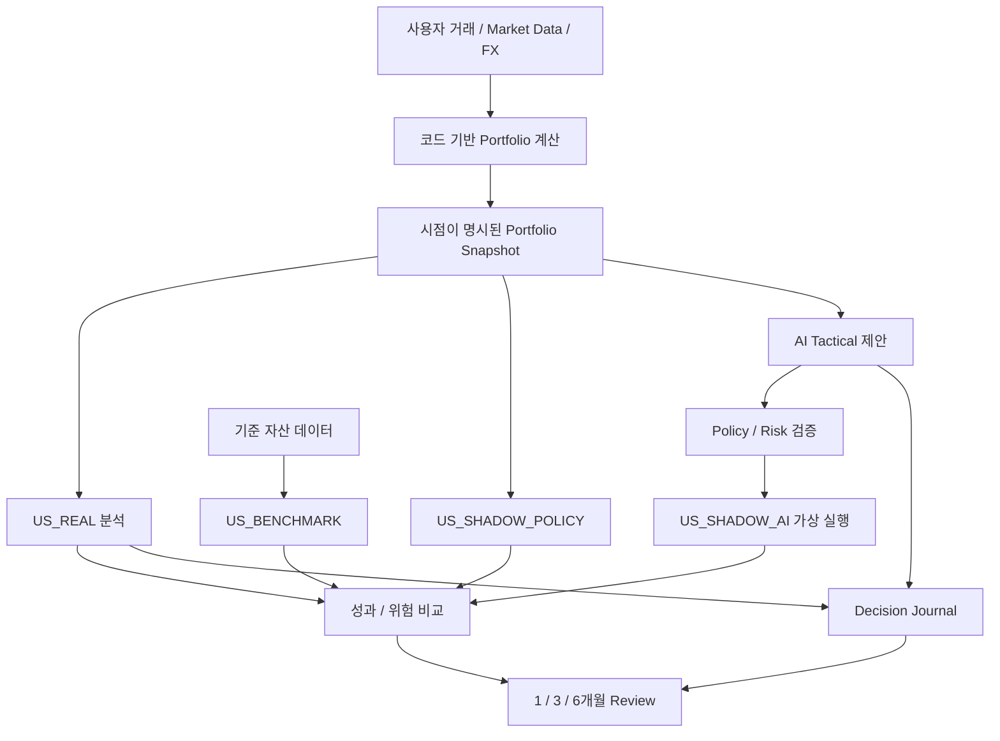
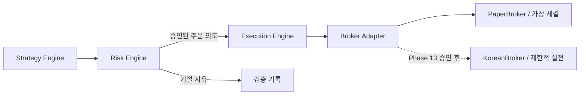

# Architecture

이 문서는 [PROJECT_SPEC.md](../PROJECT_SPEC.md)의 요구사항을 설계로 설명한다. **main의 현재 구현은 Portfolio Foundation, Market Data 정규화, 현재 미국 계좌 분석이다.** `feat/phase-4-policy-engine`과 후속 P4-05 Policy evaluator는 미병합 후보이며 현재 main의 기능이 아니다. Budget/Cashflow의 BUD-01 순수 계산·오프라인 보고도 이 별도 브랜치의 **미병합 후보**다. AI·Risk·Execution·Broker·웹·운영 흐름은 향후 설계다. main의 정책 설정 파일은 아직 실행 코드에서 읽지 않는다.

## 1. 공통 Domain과 의존성

미국 장기 자산운용과 한국 전략 검증은 계좌, 포트폴리오, 현금, 포지션, 거래, 평가 시점 등의 공통 개념을 공유한다. 시장별 거래 규칙과 제공자 통신은 별도 경계에 둔다. Domain은 AI SDK, Broker SDK, Market Data SDK, DB·ORM, 웹 프레임워크를 import하지 않는다.

Phase 3 `application`은 Repository와 MarketDataProvider 계약을 주입받아 순수 Portfolio 계산을 호출한다. 향후 다른 use case의 Risk 검사와 실행 권한은 별도 경계에서 정의한다. Infrastructure adapter가 이 계약을 구현한다.

화살표는 의존성 방향이다. 외부 제공자 응답은 경계에서 내부 데이터로 변환한다. Domain 테스트는 네트워크나 실제 계좌 없이 실행 가능해야 한다. Phase 1의 Decimal·원가·거래 시각 기준은 명세 17절에서 정했고, Phase 3는 현재 USD/KRW 보고 환산만 정했다. 역사적 성과용 FX 기준과 표시·Broker·세금 반올림은 OD-01에 남겨 두었다.

## 2. 논리적 모듈

아래는 책임 지도다. Phase 1의 `domain`, `portfolio`, `storage`, Phase 2의 `market`, Phase 3의 `application`을 구현했으며 나머지는 실제 책임이 생길 때 만든다.

| 모듈 | 책임 | 경계 |
| --- | --- | --- |
| `domain` | 공통 식별자·금융 개념·불변식·provider/repository 계약 | 외부 SDK와 저장소 구현에 독립 |
| `portfolio` | 투자 계좌·포지션·Transaction Ledger·현금과 평가·손익 계산 | 계산 결과의 근거와 시점 보존 |
| 후보 `budget` | 개인 재무 기록·예정 현금흐름·월 예산의 순수 계산 | 투자 Transaction Ledger와 별도 기록; BUD-01은 AI·DB·Broker 독립 |
| `application` | Repository·Market Provider를 조합한 현재 미국 계좌 분석 | 관측 시점·통화·신선도 확인 후 순수 계산 호출 |
| `market` | 가격·FX·시장 상태의 조회 계약과 정규화 | 외부 API adapter와 순수 데이터 검증 분리 |
| `research` | Research 자료, Investment Thesis, Decision Journal | 당시 근거와 사후 결과를 구분 |
| `risk` | Portfolio Policy, 자금·포지션·손실 제한의 코드 기반 검증 | LLM 해석에 의해 판정이 바뀌지 않음 |
| `strategy` | 코드로 정의된 전략과 주문 의도 생성 | Broker 직접 호출 금지 |
| `execution` | Risk 승인 검증, 주문 상태·중복 방지·체결·취소·대사 | 승인 없는 주문 전달 금지 |
| `broker` | Mock/Paper/실제 provider의 통신·체결 adapter | 실행 모드·계좌 capability 구분 |
| `agents` | AI Provider 추상화, 자료 해석과 제안 | 계산·정책 수정·주문 실행 권한 없음 |
| `storage` | SQLite repository 구현과 향후 DB 이전 | Domain에 SQL·ORM 객체를 노출하지 않음 |
| `reports` | 검증된 데이터와 AI 설명의 보고서 구성 | 수치를 독자적으로 재계산하지 않음 |

논리적 모듈 하나에 Domain 로직과 adapter가 모두 생기면 파일 수준으로 먼저 분리한다. 필요가 확인되기 전에 다층 패키지나 프레임워크를 추가하지 않는다. Backtest와 Shadow Engine의 구체적 패키지 배치는 각각 Phase 9와 Phase 5에서 결정한다.

### 개인 재무와 투자 원장의 경계 — 향후 설계

개인 재무 기록은 급여·소비·카드 사용/지급·부채 상환·저축 예약·본인 계좌 이동과 앞으로의 납부 일정을 다룬다. 현재 `Transaction`/`SQLiteStore`는 **투자 계좌의 Ledger**이며 개인의 급여·소비 원장이 아니다. 투자 계좌의 `DEPOSIT`을 개인 소득으로, `WITHDRAW`를 개인 소비로 재해석하지 않는다. 두 기록은 출처가 확인된 이동 ID와 양쪽 계좌·통화·시각으로 연결하되 중복 소득·소비를 만들지 않는다. 카드 사용의 소비 발생일과 카드대금 현금 지급일도 별도로 연결한다. 부채 원금과 이자·수수료는 납부 현금에는 모두 포함하지만 소비·순자산 표시는 각각의 의미로 계산한다.

공통 금액·통화·시점·출처 규칙은 재사용한다. 모든 금액은 `Decimal`이고 통화 및 유효 시점·기록 시점·출처를 보존한다. 다른 통화를 출처 없는 환율로 더하지 않고, 값 누락을 0으로 변환하지 않는다. 기존 보호자금 잔액은 개시 잔액이며 신규 소득이 아니다. 예산 배정은 현금 이동 사실이 아니므로 실제 이동 관측과 대사 전에는 완료로 기록하지 않는다. 개인정보·계좌 식별자·토큰은 최소 수집·표시하고 저장소와 로그에 실제 값을 넣지 않는다.

후보 `budget.monthly.calculate_month`는 개인 1명/KRW/월 단위의 **검증 가능한 순수 함수**다. 수동 입력된 실수령 입금·확정 예정 입금, 개시 가용현금, 날짜별 지출·상환, 이미 사용·예약한 금액, 목표와 사용자 예산 정책을 입력받아 월 배정안·미배정액·부족액·날짜별 현금 부족·판단 불가 사유를 반환한다. 미확정 수입, 대출, 미실현 투자이익을 확정 재원에 섞지 않는다. AI·DB·Broker·clock에 의존하지 않고 기준 월·평가 시점은 호출자가 명시한다. 월초 계획과 월중 관측 잔액에서 시작하는 계산을 분리하며 계산 결과에 입력의 출처·시각을 연결한다. `cash_days`는 일마감 추정이며 장중 순서를 보장하지 않는다. 저장·버전·정정은 BUD-02, 실제 자금 연결은 BUD-03에서 별도로 검증한다.

이 후보의 `balance_date`는 관측 잔액을 재생하기 시작하는 날짜이고, `evaluated_at`은 KST 기준 현재 날짜 및 기록 사용 가능 시각이다. 관측 기록은 평가 시각 뒤에서 가져올 수 없다. 지난 예정 소득은 실제 입금으로 승격하지 않고 미확인 사유로 남긴다. `current_cash`는 평가 시점까지 관측된 입출금만 반영하며, `cash_days.ending_cash`는 과거 확인 기록 및 오늘·미래의 예정 현금 경로다. `original_plan_margin`은 월초 잔액이 주어졌을 때 그 잔액과 공급된 정책으로 계산한 원안 시나리오다. `allocation_margin`·`unallocated`·`shortage`는 현재 확인된 현금에서 기존 보호액, 미집행 계획·추가 예약, 미납 카드대금을 차감한 현재 잔여 판단이다. `expected_allocation_margin`은 미래 예정 소득을 더한 별도 전망이다. 계획 총액은 `AllocationResult.planned`에 보존하고 신규 투자 제안은 사용·예약 후의 투자 잔여액만 합산한다. 카드 사용은 소비·예산 사용이고 연결된 카드 납부는 현금 지급이므로, 지급 전 카드대금만 현재 약속에서 별도 차감한다.

`Allocation.reserved`는 실제 사용액과 별개의 미집행 약속이다. 현재 용도별 미집행 약속은 `max(planned - used, reserved + 예약과 연결되지 않은 미래 확정 지출, 0)`이며 사용액을 현금과 계획에서 다시 차감하지 않는다. 날짜별 가용현금은 목표 외 예약도 보호한다. 예약과 동일한 미래 지급은 `CashEntry.reservation_draw`로 연결할 때 지급일에 그 예약 보호액을 해제한다. 연결되지 않은 지급과 예약은 별개 약속으로 보수적으로 계산하고, 연결액이 해당 용도 예약을 넘거나 관측된 과거 지급에 붙으면 입력을 거부한다. 이 필드는 순수 시뮬레이션의 관계 표시이며 자금 예약·취소 시스템이 아니다. 현재 목표 납입 예약은 기존 `existing_protected`·`protected_floor` 중 큰 보호액과 구분하고, 납입일에 추가로 배정한 금액을 그 뒤 날짜까지 보호한다. 이미 관측된 목표 납입은 `GoalContribution`과 `saved_amount`에 반영하고 보호액과 중복 합산하지 않는다. `cash_days.available_cash`는 총현금에서 이 보호액과 미집행 예약·목표 배정을 제외한 계획 가용액이며 실제 출금 잔액이 아니다. 과거 납입일에 관측 납입이 없으면 미확인으로 표시하고 남은 납입 가능일만 필요 적립액 분모에 넣는다. 필수 기록·정책이 없으면 가용 판단은 `None`이다. 모든 금액 계산·부족액 메시지는 호출자의 Decimal context와 독립적으로 처리한다.

주택·노후 목표의 금액이나 기한이 미정이어도 목표 레코드를 허용한다. 필요 적립액은 계산 불가 이유와 필요한 입력을 가진 `UNKNOWN`이고, 확인된 수입·지출·현금흐름의 계산은 계속한다. 보호자금 정책 미정 상태에서 남은 잔액을 확정 투자 가능액으로 승격하지 않는다. 목표별 배정은 공유 자금에서 한 번만 차감한다. 기존 네 자산군 Policy 값은 개인화 전략 입력으로 자동 변환하지 않는다.

향후 연결 순서는 **예산안 → 인간 승인 → 자금 배정 예약 → 실제 이동 관측·대사 확인 → 기존 투자 Policy/Risk 경계**다. 이 흐름은 아직 구현되지 않았다. 승인된 예산 잔여액과 실제 가용현금은 별개의 제한이며, 한국 월 추가배정은 계좌 운용자본이나 주문·손실 한도가 아니다. 중복 예약·취소·만료 및 권한 검사는 BUD-03의 계약이다. 예산 승인만으로 송금·환전·주문을 허용하지 않고, 미국 실제 자동주문 금지와 한국의 단계별 Risk·인간 승인은 계속 적용한다. 가상 PAPER/SHADOW 자금은 개인 실제 현금과 결합하지 않는다. AI는 결과의 근거를 인용해 설명·수정 제안만 할 수 있다. [BUD 작업과 완료 조건](ROADMAP.md#budget--cashflow-planning-확장)은 ROADMAP에 둔다.

### 사용자 접속과 실행 수명 — 향후 설계

맥미니의 별도 계산·기록 프로그램이 초기 실행 주체다. 모바일·PC 웹앱은 주 화면, 텔레그램은 알림과 제한된 간단 조회 adapter다. 브라우저 세션이나 텔레그램 연결 종료가 계산·기록 프로그램의 실행 수명을 결정하지 않도록 경계를 둔다. 먼저 로컬 접근·복구를 검증하고, 이후 인증·원격접속·백업/복구와 텔레그램 조회 권한·개인정보 최소 노출을 검증한다. 특정 웹 프레임워크나 네이티브 앱은 정하지 않았다. 텔레그램 메시지는 예산·Policy 승인, 송금 또는 주문 자격 증명이 아니다. [사용 경로 의존성](ROADMAP.md#사용-채널과-운영-의존성)은 ROADMAP에서 추적한다.

### Phase 2 Market Data 경계

`market.provider.MarketDataProvider`는 Asset 목록에서 asset_id별 `MarketQuote`를, 통화 방향에서 `FxQuote`를 얻는 계약이다. 내부 quote 타입과 순수 신선도 판정은 `market.models`, 공통 오류는 `market.errors`, Twelve Data HTTP·응답 파싱과 명시적 asset_id→symbol/exchange resolver는 `market.twelve_data`에 둔다. 다른 provider도 내부 타입과 계약을 따를 수 있다. 첫 adapter는 미국 USD 주식·ETF 가격과 FX를 조회하며 한국 가격 adapter는 없다. 표준 라이브러리 `urllib`에 명시적 timeout과 주입 가능한 HTTP 함수를 사용하므로 추가 runtime dependency 없이 네트워크 없는 adapter 테스트를 수행한다. API key는 Authorization 헤더로 전송해 URL에 포함하지 않는다.

Twelve Data `/quote`는 기본 `1day`의 `close`와 마지막 1분 캔들 시각이 섞이지 않도록 `interval=1min`을 명시한다. 응답의 `timestamp`와 `last_quote_at`이 동일한 1분 캔들을 가리킬 때만 그 캔들 시작 시각을 `as_of`로 쓴다. 둘이 없거나 다르면 `as_of=None`이다. 이 시각은 정확한 마지막 거래 시각이 아니며 가격 기준을 보수적으로 나타낸다. `/exchange_rate`의 `timestamp`는 환율 시각이다. 출처는 `twelve_data`이고 모든 내부 시간은 UTC다. `as_of=None`이면 최신 가격임을 입증할 수 없으므로 stale다. 호출자가 기준 시각과 `max_age`를 지정하고 투자용 threshold는 아직 정하지 않는다. `FxQuote.rate`는 base 1단위당 quote 통화 단위다. 제공자 오류를 명시적 Market Data 오류로 바꾸며 가상 가격 자동 fallback은 없다.

Portfolio `value_at_prices()`는 여전히 순수 함수다. Phase 3 orchestration에서 quote의 asset_id·통화·신선도·시점을 확인한 뒤 `{asset_id: Decimal}`을 만들어 전달한다. FX는 USD Ledger에 적용하지 않고 KRW 보고 값에만 사용한다. 최신 quote cache/과거 가격 history 테이블은 만들지 않았다. 데이터 라이선스, 시세 지연, 수정주가, 상장폐지, point-in-time 보장 및 실제 투자용 freshness 정책은 OD-04에 남긴다.

### Phase 3 현재 상태 분석

`USPortfolioAnalyzer`는 계좌 원장과 관련 Asset을 Repository에서 읽고 `replay()`로 상태를 재구성한다. 열린 Position의 asset_id별 `MarketQuote`를 조회하여 ID·통화·가격·출처·`as_of`와 명시된 `max_quote_age`를 검증한다. 실패한 quote가 하나라도 있으면 평가를 반환하지 않는다. USD/KRW `FxQuote`도 방향·환율·시각·신선도를 검증한다. 그 후 기존 `value_at_prices()`를 호출한다. 계산기는 Provider 또는 저장소를 import하지 않으며 Market adapter도 계산기를 호출하지 않는다.

결과는 불변 `PortfolioAnalysis`다. `evaluated_at`은 UTC로 정규화하고, Position마다 quote의 `as_of`·`fetched_at`·source를 보존한다. FX에도 별도 시각·출처를 보존하고, 사용한 quote/FX max age와 strict freshness 통과 상태를 남긴다. 단일 `market_as_of`를 합성하지 않는다. STOCK·ETF·현금 노출은 계좌 총 USD 평가액 대비 비율이다. Sector는 직접 STOCK 분류만 합산하며 미분류 STOCK과 ETF 평가액을 따로 보인다. ETF holdings look-through는 없다. USD/KRW는 보고 환산액만 만들고 USD 원장·Cost Basis를 바꾸지 않는다.

`trading_pnl`은 매매 실현손익과 열린 Position의 미실현손익의 합이다. DIVIDEND는 현금을 늘리지만 이 거래 손익에는 포함되지 않는다. 따라서 이 값은 총 투자수익률이 아니다. 과거 가격·snapshot history가 없어 CAGR·Max Drawdown·Volatility·Sharpe·Benchmark 성과를 만들지 않는다. 휴장일·주말을 고려한 freshness, 배당 포함 성과와 현금흐름 조정 방식은 OD-03/OD-04의 후속 결정이다. 실제 개인 거래 및 SQLite DB는 Git에서 제외한다.

### 사용자 입력에서 보고까지의 연결 상태

`TransactionRepository.append`와 `SQLiteStore`는 Ledger에 검증된 거래를 저장한다. `TwelveDataMarketDataProvider`는 명시적 asset_id mapping으로 가격·FX를 가져오고 `USPortfolioAnalyzer.analyze`는 시점·출처·신선도를 확인해 불변 분석을 만든다. 이들은 현재 **Python API**다. 실제 증권계좌 자료를 입력·정정·중복 제거·대사하는 사용자 경로, 수동 입력 검증 UI/CLI, 지속 실행기, 사용자 보고서가 main에 없다. 테스트 fixture를 실제 자료 반입 수단으로 간주하지 않는다.

M1 연결 설계는 `실제 거래/계좌 자료 → 입력 검증·중복/정정·대사 → Ledger append 및 재생 → 가격/FX 관측 검증 → 현재 평가 → 인간 Policy 평가 → 출처·시각·누락·UNKNOWN을 표시한 최소 보고` 순서다. Policy 단계는 Phase 4 완료 gate와 승인된 버전/적용시각을 요구한다. 검증 불가 자료나 stale quote를 임의 값으로 채우지 않는다. 보고 전달 방식·입력 방식·시세 권리와 freshness는 OD-13/OD-04에서 정하고, Phase 11의 전체 Dashboard·Daily/Weekly Report 범위는 유지한다. 운영에는 실패 알림, 재시작, 대사, 접근 권한 및 백업/복구 검증이 필요하다.

후보의 `application/policy_config.py`, `application/us_portfolio_policy.py`, `domain/policy.py`는 불변 분석과 설정을 평가하는 제안 코드다. Core/Growth 분류와 전체 Target/Range, 정책 변경 이력·적용시각·인간 승인 경계가 OPEN이므로 사용자에게 완전한 정책 적합 판정으로 전달할 수 없다. 후보를 main에 가져오기 전에는 이 파일을 main의 실행 경로로 문서화하지 않는다.

### Phase 3 감사에서 명확히 한 계약

`evaluated_at`은 현재 호출의 Ledger cutoff와 freshness 기준이다. `as_of`는 그 시각 및 `fetched_at`보다 늦을 수 없지만, 실제 취득은 호출 시작 후 완료되므로 `fetched_at > evaluated_at`은 허용한다. 모든 비교는 UTC이며 Provider clock의 정확성은 adapter 책임이다. 이 API는 과거 시점에 무엇을 알 수 있었는지 재현하는 API가 아니다. 역사적 분석에는 관측의 가용 시각·수정 이력과 당시 Ledger를 별도로 정의해야 한다.

검증한 Quote를 application 소유 mapping에 보존하고 가격과 결과 메타데이터 모두에 같은 불변 observation을 사용한다. FX 조회 중 Provider cache가 갱신되어도 이미 사용한 가격의 provenance가 바뀌지 않는다. extra quote는 사용하지 않고 필수 quote 누락은 거부한다. MarketDataError 하위 오류는 그대로 전달하며, 의미 검증은 AnalysisError, Ledger 위반은 replay의 ValueError, 저장소 장애는 Repository 오류로 구분한다. 부분 결과나 자동 fallback은 없다.

빈 계좌에도 환율·출처·시각을 제공하는 기존 결과 계약을 유지하므로 FX가 실패하면 분석도 실패한다. 산술상 0 환산에 FX가 필요해서가 아니라 명시적인 환율 관측을 제공하기 위한 계약이다. FX 없는 결과 모델은 이번 감사에서 도입하지 않는다. USD exposure는 평가 통화 기준이며 경제적 통화 노출은 아니다. Sector 비중은 현금 포함 총가치가 분모다. 금액 합계는 정확하나 순환소수 비율의 합계에는 기존 Decimal 나눗셈 정밀도 수준의 잔차가 있을 수 있다. Policy 경계에서 이를 다루는 방식은 OD-02로 남긴다.

## 3. 미국 분석과 네 포트폴리오

각 포트폴리오는 독립 상태를 갖는다. 다이어그램의 Snapshot은 공통 입력 형태를 뜻하며 동일 잔고를 공유한다는 뜻이 아니다. 초기 상태·입출금 대응 방식은 OD-03에서 정한다. `US_REAL`은 사용자의 외부 거래를 반영하고 시스템이 실제 주문을 자동 발행하지 않는다.

이 다이어그램의 Shadow·AI·Benchmark·Journal·성과 비교 노드는 향후 설계다. main에는 REAL의 현재 계좌 분석까지만 있다. 후보의 Policy evaluator도 Shadow 체결이나 사용자 보고 기능을 제공하지 않는다.

`US_SHADOW_POLICY`는 인간의 장기 Policy와 코드로 정한 리밸런싱 규칙을 따른다. `US_SHADOW_AI`는 당시 AI 제안과 Policy/Risk 검증 결과를 연결한다. 제안 시점 이후의 체결 가능 정보와 비용을 사용해 가상 실행하며, 미래 정보로 과거 제안을 개선하지 않는다. 두 Shadow는 실제 Broker 주문으로 라우팅할 수 없어야 한다.

성과 비교는 Total Return, Max Drawdown, Volatility, Sharpe Ratio, Cash Ratio, Concentration, Sector Exposure를 포함한다. 계산식·가격/FX 시점·통화·비용·배당·현금흐름 규칙은 동일한 비교 기준으로 명시하며, 아직 미정인 방식은 OD-03에서 해결한다.

## 4. 인간 Policy와 AI 경계

Policy 값은 [기본 설정](../config/us_portfolio_policy.toml)에 선언되어 있다. 코드에 수치를 복제하지 않는다. Phase 4에서 단위·합계·범위·한도 간 일관성 등을 검증하는 설정 loader와 evaluator를 만든다.

향후 application은 인간이 승인한 Policy 버전을 읽어 Risk Engine에 전달한다. AI에는 분석에 필요한 읽기 전용 데이터만 제공하며, Policy 저장소 쓰기 권한과 Broker credentials를 제공하지 않는다. Policy 변경 경로는 AI 제안 경로에서 분리하고 인간의 변경 이력과 적용 시점을 남긴다. 이를 강제하는 구체적 권한 구조는 OD-02에서 결정한다.

AI 출력은 검증되지 않은 입력으로 취급한다. Research 문서나 모델 응답 안의 명령은 시스템 권한을 변경할 수 없다. 금융 계산, Risk Limit 및 Order Quantity는 코드에서 생성한 결과를 사용한다. LLM이 임의로 작성한 수치를 잔고·손익·Risk 판정으로 저장하지 않는다.

## 5. 한국 주문 흐름과 모드 격리

이 한국 주문 다이어그램은 Phase 8–13의 설계다. 현재 main과 Policy 후보에는 Strategy/Risk/Execution/Broker 런타임 경로가 없다. Phase 8 Paper 기반과 Phase 9 Backtest 후 Phase 10 실시간 가상 운영을 검증하고, Phase 12 adapter·독립 Risk gate 및 Phase 13 인간 승인 전에는 실주문을 활성화하지 않는다. Broker 후보(Toss 포함)의 API capability와 운영 가능 시간은 OD-14에서 실제 문서·환경으로 확인한다.

Strategy는 주문 의도만 만든다. Risk는 계좌 상태와 설정에 따라 코드로 제한을 평가하고, 거절 사유와 평가 입력을 남긴다. Execution은 Risk 승인과 실행 모드·계좌가 일치하는지 확인하고 주문을 Broker Adapter에 전달한다. Strategy·AI가 Execution 또는 Broker에 직접 접근해 검증을 생략할 수 없는 의존성 구조를 유지한다.

주문 수량 계산의 상세 분담은 OD-07에서 정하되, Strategy가 제안한 수량을 그대로 신뢰하지 않는다. 최종 수량·가격 조건·현금 예약·한도 검증은 코드가 맡는다. 승인 후 계좌 상태가 바뀌었을 때의 재검사, 동시 주문 자금 예약, 중복 키, 통신 실패 후 재시도와 대사는 Execution 계약에서 반드시 다룬다. 유효한 승인을 확인할 수 없으면 주문을 진행하지 않는다.

PaperBroker는 Commission, Tax, Slippage, Partial Fill, Rejected Order, Market Hours, Available Cash, Position Limit, Daily Loss Limit, Duplicate Order Protection을 실제와 유사하게 다룰 수 있어야 한다. Risk의 제한 판정과 Broker의 체결 결과는 별도 기록으로 보존한다. 구체적인 값과 모델은 OD-05/07에서 정의한다.

MockBroker는 단위 테스트 대역, PaperBroker는 가상 실행 구현이다. 둘 다 실제 Broker로 암묵적으로 fallback하지 않는다. 실전 credentials를 넣거나 provider를 바꾸는 것만으로 `KR_PAPER`가 실전 계좌로 전환되어서는 안 된다. 실전은 별도 포트폴리오 식별·인간 승인·검증을 요구한다.

## 6. Broker 계약

개념상 `get_accounts`, `get_balance`, `get_positions`, `get_orders`, `place_order`, `cancel_order`를 제공한다. 메서드의 데이터 타입, 동기/비동기 방식, 오류 모델과 capability 계약은 구현 전에 결정한다. Phase 0에 interface stub을 만들지 않는다.

MockBroker, PaperBroker, KoreanBroker, USBroker는 가능한 adapter 예시다. 제공자 선정은 미결정이다. 조회 권한과 주문 권한은 구분하며, USBroker를 도입해도 `US_REAL` 자동 주문을 허용하지 않는다. Phase 12는 조회·sandbox·paper 중심의 연결과 장애 검증을 수행하고, Phase 13 이전에는 실제 주문 기능을 활성화하지 않는다.

## 7. 저장과 재현성

SQLite로 시작하고 repository 계약 뒤에 DB 구현을 둔다. Domain은 연결 문자열, 테이블, ORM에 의존하지 않는다. PostgreSQL 이전을 자동으로 보장한다고 가정하지 않으며, 이후 SQL 차이·트랜잭션·정밀도·동시성·마이그레이션 검증이 필요하다. Phase 0에는 DB 파일·Schema·SQLAlchemy를 추가하지 않는다.

향후 Portfolio Snapshot, Policy 버전, 가격/FX의 기준 시점과 출처, 전략 버전, AI 입력·제안, Risk 결과, 주문·체결, Journal/Thesis를 관련 식별자로 연결한다. 이는 데이터 요구사항이며 현재 DB Schema를 확정하는 것이 아니다. 과거 의사결정의 입력을 사후 최신 값으로 교체하지 않는다.

Backtest는 당시 존재하고 사용 가능했던 종목·정보를 사용한다. 신호 생성 시점과 체결 가능 시점을 구분하고 Entry/Exit 가격·Fee·Tax·Slippage·기업행사 처리 가정을 저장한다. Live-market Paper Trading에서 동일한 Strategy/Risk 계약을 재사용하여, 과거 시뮬레이션과 실시간 조건의 차이를 측정한다.

## 8. 현재 구조와 후속 확장

main의 실제 코드 위치는 `src/asset_copilot/domain/{models,repositories}.py`, `portfolio/calculator.py`, `storage/sqlite.py`, `market/{provider,models,errors,twelve_data}.py`, `application/us_portfolio_analytics.py`다. 회귀 테스트는 `tests/test_portfolio_domain.py`, `test_sqlite_repositories.py`, `test_market_data.py`, `test_twelve_data.py`, `test_us_portfolio_analytics.py`와 bootstrap test에 있다. `config/`는 저장소 내 선언 파일이며 설치 패키지의 runtime resource 계약은 아직 없다. `.env.example`에는 실제 credentials를 요구하지 않는다.

## 9. 검증 전략

Phase 0은 설치된 패키지 import와 pytest 실행만 smoke test로 확인했다. Phase 1은 Ledger의 손계산 fixture, 잘못된 입력, 재생 순서, 계좌 격리, SQLite 정밀도 왕복·재개방·불변 트리거·복수 연결에서의 이중 지출 거부를 검증한다. 이 테스트로 주문 안전성이 검증되었다고 주장하지 않는다.

후속 Phase에서는 금융 계산의 단위·반올림·불변식, Policy 경계값, 계좌 간 격리, 비용·부분 체결·주문 거절, 중복 주문·재시도·통신 실패·대사, point-in-time 데이터와 Backtest 재현성을 단계에 맞게 검증한다. 실제 계좌 연결 전에는 Broker / Execution Safety Audit과 최종 Safety Audit을 별도로 수행한다.

미결정 사항의 원장은 [PROJECT_SPEC의 Open Decisions](../PROJECT_SPEC.md#15-open-decisions)다. 이 문서에서 임의의 제공자, 수익률 계산식, 위험 한도 또는 실전 승인 기준을 추가하지 않는다.

## 10. Phase 1 Ledger와 SQLite 구현

Portfolio는 운용 목적, Account는 Ledger와 잔고의 독립 경계다. Account는 하나의 Portfolio에 연결되며 Portfolio 하나에 Account 여러 개를 만들 수 있다. 계좌 간 거래·현금·포지션을 합쳐 재생하지 않는다. `AccountType`은 상태 구분용이고 Phase 1 계산에 계좌별 특례를 만들지 않는다.

`Transaction`은 frozen Domain record다. 계좌별 양의 연속 `sequence`는 안정적인 기록 순번이며 동일한 `executed_at`의 tie-breaker다. 시간대가 있는 `executed_at`은 금융 이벤트의 발생 시각이다. Domain의 `replay` 함수는 먼저 sequence의 완전성·유일성을 검증하고, 그다음 `(executed_at ASC, sequence ASC)` 순으로 Accounting 상태를 계산한다. 뒤늦게 발견된 과거 거래도 다음 sequence로 기록할 수 있다. 전체 이력의 어느 시점에서든 현금 부족·초과 매도·통화 불일치 등이 생기면 추가를 거부한다. 거래는 한 통화·한 계좌·선택적인 한 자산에 속한다.

Replay 결과는 불변 `AccountSnapshot`이며 Cash, 현재 Position, 평균 원가, 잔여 Cost Basis, Total Invested Cost, 누적 Realized PnL을 포함한다. 수동 asset_id→Decimal 가격 mapping을 넣는 별도 함수가 시장가치·Unrealized PnL·총가치·Position Weight·Cash Ratio를 계산한다. Snapshot을 authoritative 저장 상태로 쓰지 않는다. 모든 열린 Position의 asset_id 가격이 필요하고, 추가로 조회된 가격은 무시한다. 같은 ticker를 가진 자산도 ID별로 평가한다. Provider symbol/ticker를 Domain Asset ID로 resolve하는 책임은 Phase 2 Market Data에 둔다.

`domain/repositories.py`는 Portfolio·Account·Asset·Transaction Repository 계약을 정의한다. `storage/sqlite.py`의 adapter는 네 테이블과 계좌별 sequence 유일 제약을 사용한다. Decimal 컬럼은 `TEXT`이고 Python Decimal을 `str()`로 직렬화한 뒤 `Decimal()`로 복원한다. SQLite NUMERIC/REAL affinity로 인한 이진 부동소수 변환을 피한다. 거래 UPDATE/DELETE는 DB 트리거가 거부한다.

`TransactionRepository.append`는 `BEGIN IMMEDIATE`로 쓰기 잠금을 얻은 후 해당 계좌의 기록을 읽고, 새 이벤트를 포함한 전체 Ledger를 유효 시각 순으로 Domain replay하여 검증하고, 성공하면 INSERT 후 commit한다. 과거 시점 backfill도 이 검증을 통과하면 저장하며 실패 시 rollback한다. 각 연결은 foreign key 검사를 켠다. 별도 연결을 통한 이중 지출도 순서대로 검증한다. 이것은 Phase 1의 단순한 동시성 계약이며 실제 주문 실행·예약·대사는 OD-07 범위다. 직접 DB 접근으로 규칙을 우회하지 않는 것이 application 계약이며, SQLite 파일에 대한 운영 권한 통제는 별도 과제다.

Cost Basis는 이동 가중평균 분석 값이다. 부분 매도의 처분 원가는 그 시점 잔여 원가 비율로 배분하고 최종 매도에서는 잔여 원가 전부를 제거한다. Dividend는 원가를 바꾸지 않는다. Cash Asset은 만들지 않았다. Cash는 거래 이벤트에서 파생되는 단일 통화 계좌 상태이고, Asset 테이블은 거래·배당 대상 STOCK/ETF를 표현하기 때문이다. Tax Lot, 기업행사와 역사적 성과용 FX·가격 시점 기준은 후속 Phase에서 정의한다.

## 11. Phase 1 감사에서 보완한 경계

- 시간 정렬은 `executed_at.astimezone(UTC)`와 sequence를 사용한다. DST 종료 때 같은 timezone 객체의 wall-clock 순서가 실제 순서와 달라지는 문제를 피한다. 저장은 offset을 포함한 ISO 시각을 사용하며, 재생 전후 같은 금융 시각으로 해석한다.
- 나눗셈 정밀도는 `max(80, 분자 계수 자릿수 + 4 × 분모 계수 자릿수)`다. 유한소수의 약분된 분모는 2와 5의 거듭제곱이므로 이 상한으로 유한소수 결과를 보존할 수 있다. 소수 지수는 유효숫자에 중복 반영하지 않는다. 순환소수의 매우 작은 배분 오차는 잔여 원가에 남고, 마지막 매도에서 잔여 원가 전부를 사용한다. Decimal context의 모든 설정과 오류 trap을 명시한다.
- 조회된 Asset의 `id`가 mapping key와 다르면 거부한다. 같은 ticker·다른 거래소의 자산은 여전히 각 ID로 처리한다.
- COMMIT을 예외 처리 범위에 포함하고, 중단 예외도 rollback 후 다시 전달한다. `SQLITE_BUSY`로 commit이 실패한 뒤 미완료 INSERT와 잠금이 남는 것을 방지한다. `recursive_triggers`를 켜 REPLACE도 불변 트리거를 거치게 한다.
- 기존 테스트에 반복 소수 수량 매도·재진입·다중 자산 손익·과도한 매도 수수료·DST 왕복·실제 commit 경합·동시 append를 추가했다. Phase 1 원장과 저장 검증이며, Broker 주문 예약·재시도·대사 검증을 대체하지 않는다.

남은 제한: `SQLiteStore.connection`은 관리·진단용 raw connection을 노출하므로 application은 Repository 계약만 사용해야 한다. 외부 연결이나 직접 SQL로 새 이벤트 삽입·설정 변경을 하는 것은 불변식 보장 범위 밖이다. 전체 replay 기반 append의 장기 성능, Ledger 숫자 입력의 자릿수·지수 자원 한도, migration·backup 운영은 후속 결정이 필요하다. Market Quote에는 currency·기준 시각·출처가 있지만 순수 Portfolio 가격 mapping에는 없으므로 Phase 3 application이 quote 검증과 변환을 맡는다.
